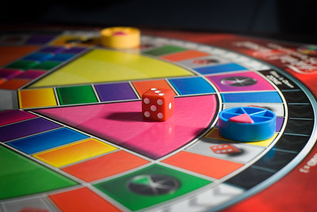

= The rules of Trivia

[%autowidth,cols=2, frame=none, grid=none]]
|====
a|
ifndef::env-github[]
image:triviapursuit.jpg[]
endif::[]
ifdef::env-github[]

endif::[]
link:https://www.flickr.com/photos/bcymet/3356449350[https://www.flickr.com]

| Each player takes turns.
In a game turn, the player rolls a dice and advances the number of spaces indicated.
A question from the category corresponding to the box in which it is located is asked.
If he answers correctly, he scores a point.
If he's wrong, he goes to jail.
While in prison, the player cannot advance any further until he is released.
He must answer a question correctly to be released.
The winner is the first to score 6 points.
|====

Documentation versions:
link:index.html[Classical],
link:indexWithAnimation.html[With animation],
