:sectnums:
:toc: left
:nofooter:
:stem:

= Trivia

include::../../../readme.adoc[leveloffset=+1]

View source project on link:{github}/samples/demo_trivia[Github]

== Legend

=== Categories

The questions asked to the players are chosen from the following categories: 

* [pop category]#Pop#
* [science category]#Science#
* [sports category]#Sports#
* [rock category]#Rock#

=== Board

On the board, the current player is in bold: *Chet*, Pat +
A player who has a penalty has his name enclosed in square brackets: [Chet] +
The number of points is displayed behind the player's name: Chet &#x2783; +

== Explanations and examples

include::com/adaptionsoft/games/uglytrivia/GameTest.player_advances.approved.adoc[leveloffset=+2]
include::com/adaptionsoft/games/uglytrivia/GameTest.player_scores.approved.adoc[leveloffset=+2]
include::com/adaptionsoft/games/uglytrivia/GameTest.win_the_game.approved.adoc[leveloffset=+2]
include::com/adaptionsoft/games/uglytrivia/GameTest.jail.approved.adoc[leveloffset=+2]
include::com/adaptionsoft/games/uglytrivia/GameTest.player_stay_in_penality_box.approved.adoc[leveloffset=+2]
include::com/adaptionsoft/games/uglytrivia/GameTest.play_until_someone_wins.approved.adoc[leveloffset=+2]

